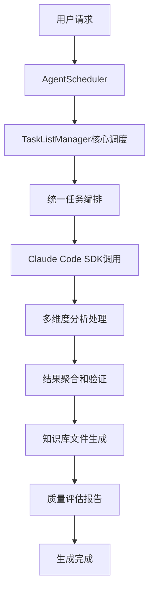

# RepoMind

基于Claude Code SDK的单仓库知识库AI Agent系统

## 项目概述

RepoMind是一个智能的单仓库知识库生成系统，通过深度分析代码仓库自动生成结构化的维基式知识库。该系统基于Claude Code SDK构建，采用多Agent协作的方式，能够智能理解代码语义、识别架构模式，并生成高质量的技术文档。

## 核心特性

- 🤖 **智能代码分析**: 基于Claude Code SDK的深层语义理解，优于简单的语法匹配
- 📚 **结构化知识库**: 自动生成符合规范的维基式文档和Mermaid图表
- 🏗️ **多Agent协作**: 7个专业分析Agent协同工作，覆盖项目分析的各个维度
- 📊 **质量保证**: 多维度质量评估、置信度计算和自动验证机制
- ⚡ **高性能执行**: 并发控制、错误恢复、智能重试机制
- 🛠️ **完整工具链**: CLI工具、编程接口、详细示例和使用指南

## 项目结构

```
src/
├── types/                    # 核心类型定义系统
│   └── index.ts             # 完整的接口和类型定义
├── agents/                  # 智能分析Agent集群
│   ├── base/                # Agent基础抽象层
│   │   └── BaseAnalysisAgent.ts
│   ├── scheduler/           # Agent调度系统
│   │   └── AgentScheduler.ts
│   ├── TaskListManager.ts   # 核心任务管理器（统一调度）
│   ├── OverviewAnalysisAgent.ts      # 项目概览分析
│   ├── ArchitectureAnalysisAgent.ts  # 系统架构分析
│   ├── ComponentAnalysisAgent.ts     # 组件设计分析
│   ├── ApiAnalysisAgent.ts           # API接口分析
│   ├── DataModelAnalysisAgent.ts     # 数据模型分析
│   └── WorkflowAnalysisAgent.ts      # 业务流程分析
├── utils/                   # 工具函数库
│   ├── index.ts            # 文件操作、项目检测、YAML处理等
│   └── sdk-helper.ts       # Claude Code SDK辅助工具
├── prompts/                 # 专业化Prompt模板系统
│   ├── index.md            # Prompt使用指南
│   ├── common-analysis-guide.md       # 通用分析指南
│   ├── overview-analysis.md           # 概览分析模板
│   ├── architecture-analysis.md       # 架构分析模板
│   ├── system-architecture-analysis.md # 系统架构专项模板
│   ├── components-analysis.md         # 组件分析模板
│   ├── apis-analysis.md              # API分析模板
│   ├── api-reference-analysis.md     # API参考文档模板
│   ├── data-models-analysis.md       # 数据模型分析模板
│   ├── workflows-analysis.md         # 工作流分析模板
│   ├── business-workflows-analysis.md # 业务流程专项模板
│   ├── dependencies-analysis.md      # 依赖分析模板
│   └── unified-analysis-tasks.md     # 统一分析任务模板
├── standard/                # 知识库规范文档
│   └── single-repo-knowledge-spec.md # 单仓库知识库标准规范
├── bin/                     # 可执行文件
│   └── cli.ts              # CLI主程序（package.json中的bin入口）
├── index.ts                 # 主入口文件和API导出
└── cli.ts                   # CLI工具兼容入口
```

## 安装和使用

### 全局安装

```bash
# 使用npm全局安装
npm install -g @repomind/core

# 使用yarn全局安装
yarn global add @repomind/core
```

### 项目内安装

```bash
# 作为项目依赖安装
npm install @repomind/core

# 使用yarn安装
yarn add @repomind/core
```

## 快速开始

### 1. CLI工具使用（推荐）

安装后可以直接使用`repomind`命令：

```bash
# 为当前目录生成知识库
repomind generate

# 为指定项目生成知识库
repomind generate -p /path/to/repo

# 深度分析，不包含测试文件
repomind generate -d deep --no-tests

# 查看项目信息
repomind info

# 验证知识库质量
repomind validate

# 清理知识库文件
repomind clean

# 查看帮助
repomind --help
```

### 2. 编程方式使用

```typescript
import { generateKnowledgeBase } from '@repomind/core';

// 简单生成知识库
await generateKnowledgeBase({
  repoPath: '/path/to/your/repo',
  depth: 'normal'
});
```

### 3. 无安装直接使用

使用npx直接运行，无需安装：

```bash
# 直接使用npx运行
npx @repomind/core generate

# 为指定项目生成
npx @repomind/core generate -p /path/to/repo
```

### 3. 高级配置使用

```typescript
import { AgentScheduler, AnalysisConfig } from './src';

const config: AnalysisConfig = {
  repoPath: '/path/to/repo',
  outputPath: '/path/to/repo',
  depth: 'deep',
  includeTests: true,
  includeDocs: true,
  customPatterns: {
    services: ['**/*Service.ts', '**/services/**'],
    controllers: ['**/*Controller.ts', '**/controllers/**'],
    models: ['**/*Model.ts', '**/models/**']
  }
};

const scheduler = new AgentScheduler(2); // 最多2个并发任务
const result = await scheduler.executeKnowledgeGeneration(config);

console.log(`生成状态: ${result.status}`);
console.log(`整体置信度: ${(result.overallConfidence * 100).toFixed(1)}%`);
```

## 系统架构

RepoMind采用统一任务管理的智能架构，基于TaskListManager实现高效的知识库生成：

#### 核心组件：
1. **TaskListManager** - 核心任务管理器，统一调度所有分析任务
2. **AgentScheduler** - Agent调度器，负责任务分发和结果聚合  
3. **6个专业分析Agent** - 分别负责不同维度的代码分析

#### Agent集群：
1. **概览分析Agent** - 项目整体分析和核心概念提取
2. **架构分析Agent** - 系统架构模式识别和分层分析  
3. **组件分析Agent** - 组件识别、职责分析和依赖关系
4. **API分析Agent** - 接口发现、文档生成和示例提取
5. **数据模型分析Agent** - 数据实体识别和关系建模
6. **工作流分析Agent** - 业务流程识别和流程图生成

### 执行流程



## 知识库输出结构

生成的知识库完全符合单仓库知识库规范（基于src/standard/single-repo-knowledge-spec.md）：

```
.repomind/
├── knowledge.yaml              # 结构化知识库主索引（YAML格式）
├── meta/                       # 元数据目录
│   ├── repo-info.yaml         # 仓库基础信息和技术栈
│   ├── analysis-config.yaml   # 分析配置记录
│   ├── generation-log.yaml    # 生成过程详细日志
│   └── repo-relationships.yaml # 多仓库关联关系（预留）
├── docs/                       # 维基式文档目录
│   ├── overview.md            # 项目概览文档
│   ├── architecture.md        # 系统架构文档（内嵌架构图表）
│   ├── components.md          # 组件设计文档（内嵌组件关系图）
│   ├── apis.md                # API接口文档
│   ├── data-models.md         # 数据模型文档（内嵌实体关系图）
│   ├── workflows.md           # 业务流程文档（内嵌工作流图）
│   └── dependencies.md        # 依赖关系文档（内嵌依赖图）
└── knowledge-base/             # 分类知识库目录（预留扩展）
    ├── core/                  # 核心概念知识
    ├── patterns/              # 设计模式知识
    └── best-practices/        # 最佳实践知识
```

### knowledge.yaml 结构说明

主索引文件包含以下关键信息：
- **版本和仓库信息**: 项目基本信息和技术栈识别
- **内容索引**: 各个文档的路径和关键信息引用
- **质量指标**: 整体置信度、成功任务数、总任务数
- **元数据**: 生成时间、配置参数、统计信息

## 配置选项

系统支持灵活的配置选项：

```typescript
const config: AnalysisConfig = {
  repoPath: string;              // 项目路径
  outputPath: string;            // 输出路径（默认为项目路径）
  depth: 'shallow' | 'normal' | 'deep';  // 分析深度
  includeTests: boolean;         // 是否包含测试文件分析
  includeDocs: boolean;          // 是否包含现有文档分析
  customPatterns?: {             // 自定义匹配模式
    [key: string]: string[];
  }
};
```

## 技术亮点

### 🎯 智能化分析
- **语义理解**: 基于Claude Code的深层代码理解，超越简单语法匹配
- **模式识别**: 自动识别设计模式和架构模式
- **上下文关联**: 理解文件间的逻辑关系和业务流程

### 📈 质量保证
- **多维评估**: 从完整性、准确性、一致性等维度评估结果质量
- **置信度量化**: 为每个分析结果提供置信度评分
- **自动验证**: 交叉验证和一致性检查机制

### 🔧 工程化特性
- **错误恢复**: 智能重试和错误处理机制
- **性能优化**: 并发控制和资源管理
- **可观测性**: 详细的日志记录和统计信息

### 🎨 用户体验
- **进度显示**: 实时显示分析进度和任务状态
- **结果总结**: 清晰的结果统计和质量报告
- **灵活配置**: 支持多种配置选项和自定义模式

## 使用示例

查看完整的使用示例：

- **基础示例**: 简单的知识库生成
- **高级配置**: 自定义分析模式和参数
- **批量分析**: 处理多个项目
- **监控日志**: 详细的执行统计和性能分析

```bash
# 运行CLI工具
npm run cli generate                  # 使用开发环境CLI
npm run cli info                     # 查看项目信息
npm run cli validate                 # 验证知识库质量
npm run cli clean                    # 清理知识库文件
```

## 开发和扩展

### 添加自定义Agent

```typescript
import { BaseAnalysisAgent } from './src/agents/base/BaseAnalysisAgent';
import { AnalysisConfig } from './src/types';

class CustomAnalysisAgent extends BaseAnalysisAgent {
  readonly name = 'custom-analysis';
  readonly version = '1.0.0';
  readonly capabilities = ['custom-feature'];
  readonly dependencies = ['overview-analysis'];

  protected async analyze(config: AnalysisConfig) {
    // 实现自定义分析逻辑
    const prompt = await this.loadPrompt('custom-analysis.md');
    const customizedPrompt = this.customizePrompt(prompt, config);
    
    // 使用Claude Code SDK分析
    // ... 实现分析逻辑
    
    return {
      document: '分析结果文档',
      metadata: { /* 元数据 */ },
      references: []
    };
  }

  protected calculateConfidence(result: any): number {
    // 计算置信度
    return 0.8;
  }

  protected getDocumentTitle(projectName: string): string {
    return `自定义分析：${projectName}`;
  }
}
```

### 自定义配置模式

```typescript
const customConfig: AnalysisConfig = {
  repoPath: '/path/to/repo',
  outputPath: '/path/to/output',
  depth: 'deep',
  includeTests: true,
  includeDocs: true,
  customPatterns: {
    // 自定义匹配模式
    'custom-components': ['**/*Widget.tsx', '**/*Panel.tsx'],
    'business-logic': ['**/business/**', '**/domain/**'],
    'integration-points': ['**/integrations/**', '**/external/**']
  }
};
```

## 贡献指南

1. Fork项目
2. 创建特性分支 (`git checkout -b feature/amazing-feature`)
3. 提交更改 (`git commit -m 'Add amazing feature'`)
4. 推送到分支 (`git push origin feature/amazing-feature`)
5. 开启Pull Request

## 许可证

MIT License

## 更新日志

### v1.0.0 (2024-09-10)
- 🎉 初始版本发布
- 🤖 实现了7个专业分析Agent集群
- 📋 完整的Agent调度系统和任务编排
- 📊 多维度质量保证和置信度评估
- ⚡ 并发执行、错误恢复和性能优化
- 🛠️ 完整的CLI工具和编程接口
- 📚 详细的文档和使用示例
- 🔧 基于Claude Code SDK的智能分析

## 项目状态

✅ **核心功能已完成** - 系统已可投入实际使用  
✅ **Agent集群实现** - 7个专业Agent全部实现  
✅ **质量保证机制** - 完整的评估和验证系统  
✅ **工具链完整** - CLI、API、示例全部就绪  
✅ **文档完善** - 详细的使用指南和技术文档  

## 支持和反馈

如有问题或建议，请在GitHub Issues中提出。

---

**RepoMind v1.0** - 单仓库知识库AI Agent系统已就绪！🚀