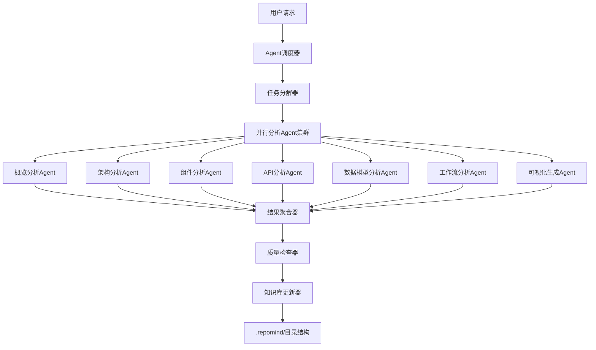
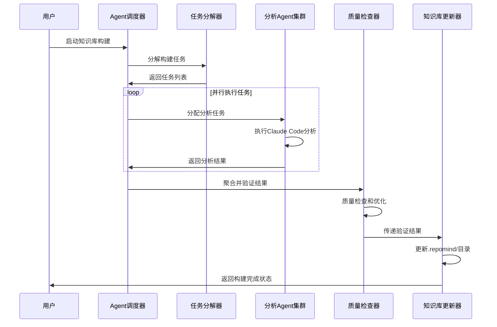
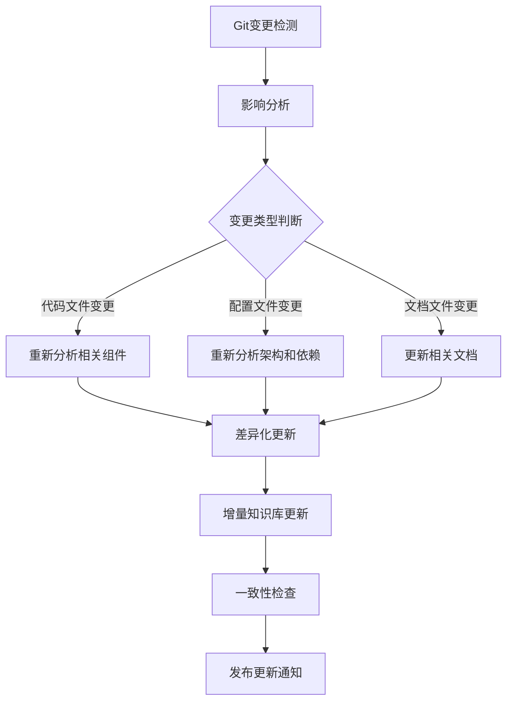

# RepoMind Agent构建方案

## 1. 概述

基于Claude Code SDK和现有的单仓库知识库规范，本方案设计了一套智能的Agent系统，用于自动化构建、维护和查询代码仓库知识库。该系统充分利用Claude Code的智能分析能力，通过结构化的Prompt工程和任务编排，实现DeepWiki式的知识库生成。

## 2. 总体架构设计

### 2.1 系统架构概览



### 2.2 核心组件说明

#### 2.2.1 Agent调度器 (AgentScheduler)
- **职责**: 统一管理所有分析Agent的生命周期
- **功能**: 任务分发、负载均衡、状态监控
- **实现**: 基于Claude Code SDK的并发查询能力

#### 2.2.2 任务分解器 (TaskDecomposer) 
- **职责**: 将复杂的知识库构建任务分解为独立的分析任务
- **功能**: 依赖分析、任务排序、资源分配
- **策略**: 基于项目规模和复杂度动态调整任务粒度

#### 2.2.3 专业分析Agent集群
- **概览分析Agent**: 项目整体分析和核心概念提取
- **架构分析Agent**: 系统架构模式识别和分层分析
- **组件分析Agent**: 组件识别、职责分析和依赖关系
- **API分析Agent**: 接口发现、文档生成和示例提取
- **数据模型分析Agent**: 数据实体识别和关系建模
- **工作流分析Agent**: 业务流程识别和流程图生成
- **可视化生成Agent**: Mermaid图表生成和优化

## 3. Agent实现架构

### 3.1 基础Agent接口设计

```typescript
import { query } from "@anthropic-ai/claude-code";

interface BaseAgent {
  name: string;
  version: string;
  capabilities: string[];
  dependencies: string[];
}

interface AnalysisConfig {
  repoPath: string;
  outputPath: string;
  depth: 'shallow' | 'normal' | 'deep';
  includeTests: boolean;
  includeDocs: boolean;
  customPatterns?: Record<string, string[]>;
}

interface AnalysisResult {
  agentName: string;
  status: 'success' | 'error' | 'partial';
  output: {
    document: string;
    metadata: Record<string, any>;
    references: string[];
  };
  executionTime: number;
  confidence: number;
}

abstract class BaseAnalysisAgent implements BaseAgent {
  abstract name: string;
  abstract version: string;
  abstract capabilities: string[];
  abstract dependencies: string[];

  async execute(config: AnalysisConfig): Promise<AnalysisResult> {
    const startTime = Date.now();
    try {
      const result = await this.analyze(config);
      return {
        agentName: this.name,
        status: 'success',
        output: result,
        executionTime: Date.now() - startTime,
        confidence: this.calculateConfidence(result)
      };
    } catch (error) {
      return {
        agentName: this.name,
        status: 'error',
        output: { document: '', metadata: { error: error.message }, references: [] },
        executionTime: Date.now() - startTime,
        confidence: 0
      };
    }
  }

  protected abstract analyze(config: AnalysisConfig): Promise<{
    document: string;
    metadata: Record<string, any>;
    references: string[];
  }>;

  protected abstract calculateConfidence(result: any): number;
}
```

### 3.2 具体Agent实现示例

#### 3.2.1 概览分析Agent

```typescript
class OverviewAnalysisAgent extends BaseAnalysisAgent {
  name = 'overview-analysis';
  version = '1.0.0';
  capabilities = ['project-analysis', 'concept-extraction', 'tech-stack-detection'];
  dependencies = [];

  protected async analyze(config: AnalysisConfig): Promise<{
    document: string;
    metadata: Record<string, any>;
    references: string[];
  }> {
    const prompt = await this.loadPrompt('overview-analysis.md');
    const customizedPrompt = this.customizePrompt(prompt, config);

    let analysisResult = '';
    const metadata: Record<string, any> = {};
    const references: string[] = [];

    for await (const message of query({
      prompt: customizedPrompt,
      options: {
        maxTurns: 5,
        allowedTools: ['Read', 'Glob', 'Grep', 'Bash'],
        systemPrompt: '你是一个专业的代码分析专家，专注于项目概览分析。'
      }
    })) {
      if (message.type === 'result' && message.subtype === 'success') {
        analysisResult = message.result;
        // 提取元数据和引用
        metadata.techStack = this.extractTechStack(message.result);
        references.push(...this.extractReferences(message.result));
        break;
      }
    }

    return {
      document: this.formatDocument(analysisResult, config),
      metadata,
      references
    };
  }

  private async loadPrompt(filename: string): Promise<string> {
    // 从src/prompts/目录加载对应的prompt文档
    const fs = await import('fs');
    return fs.readFileSync(`src/prompts/${filename}`, 'utf-8');
  }

  private customizePrompt(prompt: string, config: AnalysisConfig): string {
    return prompt
      .replace('{{REPO_PATH}}', config.repoPath)
      .replace('{{ANALYSIS_DEPTH}}', config.depth)
      .replace('{{INCLUDE_TESTS}}', config.includeTests.toString());
  }

  private extractTechStack(content: string): string[] {
    // 基于分析结果提取技术栈信息
    const techStackPattern = /技术栈[：:]\s*(.+)/i;
    const match = content.match(techStackPattern);
    return match ? match[1].split(/[,，、]/).map(s => s.trim()) : [];
  }

  private extractReferences(content: string): string[] {
    // 提取文档中的文件引用
    const refPattern = /(?:参考|引用)[：:]?\s*`([^`]+)`/g;
    const references: string[] = [];
    let match;
    while ((match = refPattern.exec(content)) !== null) {
      references.push(match[1]);
    }
    return references;
  }

  private formatDocument(content: string, config: AnalysisConfig): string {
    // 根据规范格式化输出文档
    return `# 项目概览：${this.extractProjectName(config.repoPath)}

${content}

---
*本文档由RepoMind系统自动生成于 ${new Date().toISOString()}*
*分析深度: ${config.depth}*
`;
  }

  private extractProjectName(repoPath: string): string {
    return repoPath.split('/').pop() || '未知项目';
  }

  protected calculateConfidence(result: any): number {
    // 基于文档长度、引用数量等因素计算置信度
    const docLength = result.document.length;
    const refCount = result.references.length;
    
    let confidence = 0.5; // 基础置信度
    
    if (docLength > 1000) confidence += 0.2;
    if (refCount > 3) confidence += 0.2;
    if (result.metadata.techStack?.length > 0) confidence += 0.1;
    
    return Math.min(confidence, 1.0);
  }
}
```

### 3.3 Agent调度器实现

```typescript
class AgentScheduler {
  private agents: Map<string, BaseAnalysisAgent>;
  private taskQueue: AnalysisTask[];
  private maxConcurrentTasks: number;
  private runningTasks: Set<string>;

  constructor(maxConcurrent: number = 3) {
    this.agents = new Map();
    this.taskQueue = [];
    this.maxConcurrentTasks = maxConcurrent;
    this.runningTasks = new Set();
    this.initializeAgents();
  }

  private initializeAgents(): void {
    // 注册所有分析Agent
    this.registerAgent(new OverviewAnalysisAgent());
    this.registerAgent(new ArchitectureAnalysisAgent());
    this.registerAgent(new ComponentAnalysisAgent());
    this.registerAgent(new ApiAnalysisAgent());
    this.registerAgent(new DataModelAnalysisAgent());
    this.registerAgent(new WorkflowAnalysisAgent());
  }

  private registerAgent(agent: BaseAnalysisAgent): void {
    this.agents.set(agent.name, agent);
  }

  async executeKnowledgeGeneration(config: AnalysisConfig): Promise<KnowledgeGenerationResult> {
    // 1. 任务分解
    const tasks = this.decomposeTasks(config);
    
    // 2. 依赖排序
    const orderedTasks = this.topologicalSort(tasks);
    
    // 3. 并行执行
    const results = await this.executeTasks(orderedTasks, config);
    
    // 4. 结果聚合
    const aggregatedResult = this.aggregateResults(results);
    
    // 5. 质量检查
    const validationResult = await this.validateResults(aggregatedResult);
    
    // 6. 知识库更新
    await this.updateKnowledgeBase(validationResult, config);
    
    return validationResult;
  }

  private decomposeTasks(config: AnalysisConfig): AnalysisTask[] {
    const baseTasks: AnalysisTask[] = [
      { id: 'overview', agentName: 'overview-analysis', dependencies: [] },
      { id: 'architecture', agentName: 'architecture-analysis', dependencies: ['overview'] },
      { id: 'components', agentName: 'component-analysis', dependencies: ['architecture'] },
      { id: 'apis', agentName: 'api-analysis', dependencies: ['components'] },
      { id: 'data-models', agentName: 'data-model-analysis', dependencies: ['components'] },
      { id: 'workflows', agentName: 'workflow-analysis', dependencies: ['apis', 'data-models'] },
    ];

    return baseTasks;
  }

  private topologicalSort(tasks: AnalysisTask[]): AnalysisTask[] {
    // 实现拓扑排序，确保依赖任务先执行
    const sorted: AnalysisTask[] = [];
    const visited = new Set<string>();
    const visiting = new Set<string>();

    const visit = (task: AnalysisTask) => {
      if (visiting.has(task.id)) {
        throw new Error(`Circular dependency detected: ${task.id}`);
      }
      if (visited.has(task.id)) return;

      visiting.add(task.id);
      
      for (const depId of task.dependencies) {
        const depTask = tasks.find(t => t.id === depId);
        if (depTask) visit(depTask);
      }
      
      visiting.delete(task.id);
      visited.add(task.id);
      sorted.push(task);
    };

    tasks.forEach(task => visit(task));
    return sorted;
  }

  private async executeTasks(tasks: AnalysisTask[], config: AnalysisConfig): Promise<AnalysisResult[]> {
    const results: AnalysisResult[] = [];
    const completedTasks = new Set<string>();

    for (const task of tasks) {
      // 等待依赖任务完成
      await this.waitForDependencies(task.dependencies, completedTasks);
      
      // 执行任务
      const agent = this.agents.get(task.agentName);
      if (!agent) {
        throw new Error(`Agent not found: ${task.agentName}`);
      }

      console.log(`执行任务: ${task.id} (Agent: ${task.agentName})`);
      const result = await agent.execute(config);
      results.push(result);
      
      completedTasks.add(task.id);
      console.log(`任务完成: ${task.id} (状态: ${result.status}, 置信度: ${result.confidence})`);
    }

    return results;
  }

  private async waitForDependencies(dependencies: string[], completed: Set<string>): Promise<void> {
    while (dependencies.some(dep => !completed.has(dep))) {
      await new Promise(resolve => setTimeout(resolve, 100));
    }
  }

  private aggregateResults(results: AnalysisResult[]): KnowledgeGenerationResult {
    const successResults = results.filter(r => r.status === 'success');
    const totalConfidence = successResults.reduce((sum, r) => sum + r.confidence, 0) / successResults.length;

    return {
      status: results.every(r => r.status === 'success') ? 'success' : 'partial',
      results: results,
      overallConfidence: totalConfidence,
      generatedFiles: this.extractGeneratedFiles(results),
      metadata: {
        totalTasks: results.length,
        successfulTasks: successResults.length,
        averageExecutionTime: results.reduce((sum, r) => sum + r.executionTime, 0) / results.length,
        timestamp: new Date().toISOString()
      }
    };
  }

  private extractGeneratedFiles(results: AnalysisResult[]): string[] {
    const files: string[] = [];
    results.forEach(result => {
      if (result.status === 'success') {
        // 根据agent类型确定输出文件
        switch (result.agentName) {
          case 'overview-analysis':
            files.push('docs/overview.md');
            break;
          case 'architecture-analysis':
            files.push('docs/architecture.md', 'graphs/architecture.md');
            break;
          case 'component-analysis':
            files.push('docs/components.md');
            break;
          case 'api-analysis':
            files.push('docs/apis.md');
            break;
          case 'data-model-analysis':
            files.push('docs/data-models.md', 'graphs/data-flow.md');
            break;
          case 'workflow-analysis':
            files.push('docs/workflows.md', 'graphs/workflow.md');
            break;
        }
      }
    });
    return files;
  }

  private async validateResults(result: KnowledgeGenerationResult): Promise<KnowledgeGenerationResult> {
    // 质量检查逻辑
    if (result.overallConfidence < 0.6) {
      console.warn('整体置信度较低，建议检查分析结果');
    }

    // 检查必要文件是否生成
    const requiredFiles = ['docs/overview.md', 'docs/architecture.md', 'docs/components.md'];
    const missingFiles = requiredFiles.filter(file => !result.generatedFiles.includes(file));
    
    if (missingFiles.length > 0) {
      result.metadata.warnings = [`缺少必要文件: ${missingFiles.join(', ')}`];
    }

    return result;
  }

  private async updateKnowledgeBase(result: KnowledgeGenerationResult, config: AnalysisConfig): Promise<void> {
    // 创建.repomind目录结构
    await this.ensureDirectoryStructure(config.outputPath);
    
    // 生成knowledge.yaml主索引文件
    const knowledgeIndex = this.generateKnowledgeIndex(result, config);
    await this.writeYamlFile(`${config.outputPath}/.repomind/knowledge.yaml`, knowledgeIndex);
    
    // 写入各个分析结果文档
    for (const analysisResult of result.results) {
      if (analysisResult.status === 'success') {
        await this.writeAgentOutput(analysisResult, config.outputPath);
      }
    }
    
    // 生成元数据文件
    await this.generateMetadata(result, config);
  }

  private async ensureDirectoryStructure(outputPath: string): Promise<void> {
    const fs = await import('fs');
    const path = await import('path');
    
    const directories = [
      '.repomind',
      '.repomind/meta',
      '.repomind/docs', 
      '.repomind/graphs',
      '.repomind/knowledge-base',
      '.repomind/knowledge-base/core',
      '.repomind/knowledge-base/patterns',
      '.repomind/knowledge-base/best-practices',
      '.repomind/knowledge-base/troubleshooting'
    ];

    for (const dir of directories) {
      const fullPath = path.join(outputPath, dir);
      if (!fs.existsSync(fullPath)) {
        fs.mkdirSync(fullPath, { recursive: true });
      }
    }
  }

  private generateKnowledgeIndex(result: KnowledgeGenerationResult, config: AnalysisConfig): any {
    return {
      version: '1.0.0',
      repository: {
        name: this.extractProjectName(config.repoPath),
        path: config.repoPath,
        analysis_depth: config.depth,
        include_tests: config.includeTests
      },
      generated_at: new Date().toISOString(),
      analysis_config: {
        depth: config.depth,
        include_tests: config.includeTests,
        include_docs: config.includeDocs,
        custom_patterns: config.customPatterns
      },
      content_index: {
        overview: './docs/overview.md',
        architecture: './docs/architecture.md',
        components: './docs/components.md',
        apis: './docs/apis.md',
        data_models: './docs/data-models.md',
        workflows: './docs/workflows.md'
      },
      graph_index: {
        architecture: './graphs/architecture.md',
        dependencies: './graphs/dependencies.md',
        data_flow: './graphs/data-flow.md',
        workflow: './graphs/workflow.md'
      },
      metadata: result.metadata,
      quality_metrics: {
        overall_confidence: result.overallConfidence,
        successful_tasks: result.results.filter(r => r.status === 'success').length,
        total_tasks: result.results.length
      }
    };
  }

  private async writeAgentOutput(result: AnalysisResult, outputPath: string): Promise<void> {
    const filePaths = this.getOutputPaths(result.agentName);
    
    for (const filePath of filePaths) {
      const fullPath = `${outputPath}/.repomind/${filePath}`;
      await this.writeFile(fullPath, result.output.document);
    }
  }

  private getOutputPaths(agentName: string): string[] {
    const pathMap: Record<string, string[]> = {
      'overview-analysis': ['docs/overview.md'],
      'architecture-analysis': ['docs/architecture.md'],
      'component-analysis': ['docs/components.md'],
      'api-analysis': ['docs/apis.md'],
      'data-model-analysis': ['docs/data-models.md'],
      'workflow-analysis': ['docs/workflows.md'],
    };
    
    return pathMap[agentName] || [];
  }

  private async writeFile(filePath: string, content: string): Promise<void> {
    const fs = await import('fs');
    const path = await import('path');
    
    // 确保父目录存在
    const dir = path.dirname(filePath);
    if (!fs.existsSync(dir)) {
      fs.mkdirSync(dir, { recursive: true });
    }
    
    fs.writeFileSync(filePath, content, 'utf-8');
  }

  private async generateMetadata(result: KnowledgeGenerationResult, config: AnalysisConfig): Promise<void> {
    // 生成repo-info.json
    const repoInfo = {
      name: this.extractProjectName(config.repoPath),
      path: config.repoPath,
      analysis_date: new Date().toISOString(),
      version: '1.0.0'
    };
    await this.writeFile(`${config.outputPath}/.repomind/meta/repo-info.json`, JSON.stringify(repoInfo, null, 2));
    
    // 生成analysis-config.json
    await this.writeFile(`${config.outputPath}/.repomind/meta/analysis-config.json`, JSON.stringify(config, null, 2));
    
    // 生成generation-log.json
    const log = {
      execution_id: this.generateExecutionId(),
      start_time: result.metadata.timestamp,
      end_time: new Date().toISOString(),
      tasks: result.results.map(r => ({
        agent: r.agentName,
        status: r.status,
        execution_time: r.executionTime,
        confidence: r.confidence
      })),
      overall_status: result.status,
      overall_confidence: result.overallConfidence
    };
    await this.writeFile(`${config.outputPath}/.repomind/meta/generation-log.json`, JSON.stringify(log, null, 2));
  }

  private extractProjectName(repoPath: string): string {
    return repoPath.split(/[\/\\]/).pop() || '未知项目';
  }

  private generateExecutionId(): string {
    return `exec_${Date.now()}_${Math.random().toString(36).substr(2, 9)}`;
  }
}
```

## 4. 工作流程设计

### 4.1 知识库构建流程



### 4.2 增量更新流程



## 5. 关键技术实现

### 5.1 Prompt工程策略

#### 5.1.1 动态Prompt组装
```typescript
class PromptBuilder {
  private basePrompts: Map<string, string>;
  private contextProviders: ContextProvider[];

  buildAnalysisPrompt(agentType: string, config: AnalysisConfig): string {
    const basePrompt = this.basePrompts.get(agentType) || '';
    const context = this.gatherContext(config);
    
    return this.assemblePrompt(basePrompt, context, config);
  }

  private gatherContext(config: AnalysisConfig): ContextData {
    const context: ContextData = {
      projectInfo: this.extractProjectInfo(config.repoPath),
      techStack: this.detectTechStack(config.repoPath),
      fileStructure: this.analyzeFileStructure(config.repoPath),
      existingDocs: this.scanExistingDocs(config.repoPath)
    };
    
    return context;
  }

  private assemblePrompt(base: string, context: ContextData, config: AnalysisConfig): string {
    return base
      .replace(/\{\{PROJECT_INFO\}\}/g, JSON.stringify(context.projectInfo))
      .replace(/\{\{TECH_STACK\}\}/g, context.techStack.join(', '))
      .replace(/\{\{ANALYSIS_DEPTH\}\}/g, config.depth)
      .replace(/\{\{CUSTOM_PATTERNS\}\}/g, JSON.stringify(config.customPatterns));
  }
}
```

#### 5.1.2 上下文感知分析
```typescript
class ContextAwareAnalyzer {
  async analyzeWithContext(prompt: string, config: AnalysisConfig): Promise<string> {
    // 构建上下文感知的分析请求
    const contextualPrompt = `
${prompt}

项目上下文信息:
- 项目路径: ${config.repoPath}
- 分析深度: ${config.depth}
- 技术栈: ${await this.detectTechStack(config.repoPath)}
- 项目规模: ${await this.estimateProjectSize(config.repoPath)}

请基于以上上下文信息进行深度分析，确保结果的准确性和相关性。
`;

    for await (const message of query({
      prompt: contextualPrompt,
      options: {
        maxTurns: 8,
        allowedTools: ['Read', 'Glob', 'Grep', 'Bash'],
        systemPrompt: this.buildSystemPrompt(config)
      }
    })) {
      if (message.type === 'result' && message.subtype === 'success') {
        return message.result;
      }
    }
    
    throw new Error('分析执行失败');
  }

  private buildSystemPrompt(config: AnalysisConfig): string {
    return `
你是一个专业的代码分析专家，专注于为${config.repoPath}项目生成高质量的知识库文档。

关键要求:
1. 使用中文输出所有文档
2. 遵循单仓库知识库规范
3. 确保分析的准确性和完整性
4. 生成结构化的Markdown文档
5. 在适当位置嵌入Mermaid图表

分析原则:
- 优先使用语义分析而非语法分析
- 关注代码的业务含义和设计意图
- 识别架构模式和设计原则
- 提供实用的洞察和建议
`;
  }
}
```

### 5.2 并发控制与错误恢复

#### 5.2.1 智能重试机制
```typescript
class ResilientExecutor {
  private maxRetries: number;
  private backoffStrategy: BackoffStrategy;

  constructor(maxRetries: number = 3, backoffStrategy: BackoffStrategy = 'exponential') {
    this.maxRetries = maxRetries;
    this.backoffStrategy = backoffStrategy;
  }

  async executeWithRetry<T>(
    operation: () => Promise<T>,
    context: string
  ): Promise<T> {
    let lastError: Error | null = null;
    
    for (let attempt = 1; attempt <= this.maxRetries; attempt++) {
      try {
        console.log(`执行操作: ${context} (尝试 ${attempt}/${this.maxRetries})`);
        const result = await operation();
        
        if (attempt > 1) {
          console.log(`操作成功: ${context} (在第${attempt}次尝试后成功)`);
        }
        
        return result;
      } catch (error) {
        lastError = error as Error;
        console.warn(`操作失败: ${context} (尝试 ${attempt}/${this.maxRetries}) - ${error.message}`);
        
        if (attempt < this.maxRetries) {
          const delay = this.calculateBackoff(attempt);
          console.log(`等待 ${delay}ms 后重试...`);
          await this.sleep(delay);
        }
      }
    }
    
    throw new Error(`操作最终失败: ${context} - ${lastError?.message}`);
  }

  private calculateBackoff(attempt: number): number {
    switch (this.backoffStrategy) {
      case 'linear':
        return 1000 * attempt;
      case 'exponential':
        return 1000 * Math.pow(2, attempt - 1);
      case 'fixed':
        return 2000;
      default:
        return 1000;
    }
  }

  private sleep(ms: number): Promise<void> {
    return new Promise(resolve => setTimeout(resolve, ms));
  }
}
```

### 5.3 质量保证机制

#### 5.3.1 多维度质量评估
```typescript
class QualityAssurance {
  async validateKnowledgeBase(result: KnowledgeGenerationResult): Promise<ValidationReport> {
    const report: ValidationReport = {
      overall_score: 0,
      dimensions: {},
      issues: [],
      suggestions: []
    };

    // 内容完整性检查
    report.dimensions.completeness = await this.checkCompleteness(result);
    
    // 准确性验证
    report.dimensions.accuracy = await this.verifyAccuracy(result);
    
    // 一致性检查
    report.dimensions.consistency = await this.checkConsistency(result);
    
    // 可读性评估
    report.dimensions.readability = await this.assessReadability(result);
    
    // 计算总体评分
    report.overall_score = this.calculateOverallScore(report.dimensions);
    
    // 生成改进建议
    report.suggestions = this.generateSuggestions(report);
    
    return report;
  }

  private async checkCompleteness(result: KnowledgeGenerationResult): Promise<number> {
    const requiredSections = ['overview', 'architecture', 'components', 'apis'];
    const generatedSections = result.generatedFiles.map(f => f.split('/')[1].replace('.md', ''));
    
    const coverage = generatedSections.filter(s => requiredSections.includes(s)).length / requiredSections.length;
    return coverage;
  }

  private async verifyAccuracy(result: KnowledgeGenerationResult): Promise<number> {
    // 通过交叉验证和置信度计算准确性评分
    const avgConfidence = result.results.reduce((sum, r) => sum + r.confidence, 0) / result.results.length;
    
    // 检查文档中的代码引用是否存在
    let referenceAccuracy = 1.0;
    for (const analysisResult of result.results) {
      if (analysisResult.output.references) {
        const validRefs = await this.validateReferences(analysisResult.output.references);
        referenceAccuracy *= validRefs;
      }
    }
    
    return (avgConfidence + referenceAccuracy) / 2;
  }

  private async checkConsistency(result: KnowledgeGenerationResult): Promise<number> {
    // 检查术语使用的一致性
    const termConsistency = await this.checkTerminologyConsistency(result);
    
    // 检查架构描述的一致性
    const archConsistency = await this.checkArchitecturalConsistency(result);
    
    return (termConsistency + archConsistency) / 2;
  }

  private async assessReadability(result: KnowledgeGenerationResult): Promise<number> {
    // 基于文档结构、语言清晰度等因素评估可读性
    let totalReadability = 0;
    let documentCount = 0;
    
    for (const analysisResult of result.results) {
      if (analysisResult.status === 'success') {
        const readabilityScore = this.calculateDocumentReadability(analysisResult.output.document);
        totalReadability += readabilityScore;
        documentCount++;
      }
    }
    
    return documentCount > 0 ? totalReadability / documentCount : 0;
  }
}
```

## 6. 配置与扩展性

### 6.1 配置化支持

```typescript
interface RepoMindConfig {
  analysis: {
    depth: 'shallow' | 'normal' | 'deep';
    includeTests: boolean;
    includeDocs: boolean;
    customPatterns?: {
      components: string[];
      apis: string[];
      models: string[];
    };
  };
  
  agents: {
    maxConcurrent: number;
    timeout: number;
    retryPolicy: {
      maxRetries: number;
      backoffStrategy: 'linear' | 'exponential' | 'fixed';
    };
  };
  
  output: {
    format: 'standard' | 'compact' | 'detailed';
    language: 'zh-CN' | 'en-US';
    includeGraphs: boolean;
    customSections?: string[];
  };
  
  quality: {
    minConfidenceThreshold: number;
    enableValidation: boolean;
    validateReferences: boolean;
  };
}
```

### 6.2 插件化扩展

```typescript
interface AnalysisPlugin {
  name: string;
  version: string;
  supportedFileTypes: string[];
  analyze(files: string[], config: AnalysisConfig): Promise<PluginResult>;
}

class PluginManager {
  private plugins: Map<string, AnalysisPlugin>;

  registerPlugin(plugin: AnalysisPlugin): void {
    this.plugins.set(plugin.name, plugin);
  }

  async executePlugins(files: string[], config: AnalysisConfig): Promise<PluginResult[]> {
    const results: PluginResult[] = [];
    
    for (const [name, plugin] of this.plugins) {
      const supportedFiles = files.filter(file => 
        plugin.supportedFileTypes.some(type => file.endsWith(type))
      );
      
      if (supportedFiles.length > 0) {
        try {
          const result = await plugin.analyze(supportedFiles, config);
          results.push(result);
        } catch (error) {
          console.warn(`Plugin ${name} execution failed:`, error);
        }
      }
    }
    
    return results;
  }
}
```

## 7. 使用示例

### 7.1 基础使用

```typescript
import { AgentScheduler, AnalysisConfig } from './src/agents';

async function generateKnowledgeBase() {
  const scheduler = new AgentScheduler();
  
  const config: AnalysisConfig = {
    repoPath: '/path/to/your/repo',
    outputPath: '/path/to/your/repo',
    depth: 'normal',
    includeTests: true,
    includeDocs: true
  };
  
  try {
    const result = await scheduler.executeKnowledgeGeneration(config);
    
    if (result.status === 'success') {
      console.log('✅ 知识库构建完成！');
      console.log(`📊 整体置信度: ${(result.overallConfidence * 100).toFixed(1)}%`);
      console.log(`📄 生成文件数: ${result.generatedFiles.length}`);
    } else {
      console.warn('⚠️ 知识库构建部分成功，请查看详细报告');
    }
    
  } catch (error) {
    console.error('❌ 知识库构建失败:', error);
  }
}
```

### 7.2 高级配置使用

```typescript
async function generateAdvancedKnowledgeBase() {
  const scheduler = new AgentScheduler();
  
  const config: AnalysisConfig = {
    repoPath: '/path/to/complex/repo',
    outputPath: '/path/to/complex/repo', 
    depth: 'deep',
    includeTests: true,
    includeDocs: true,
    customPatterns: {
      'services': ['**/*Service.ts', '**/*service.js'],
      'controllers': ['**/*Controller.ts', '**/controllers/**'],
      'models': ['**/*Model.ts', '**/models/**', '**/entities/**']
    }
  };

  // 注册自定义插件
  const pluginManager = new PluginManager();
  pluginManager.registerPlugin(new DatabaseAnalysisPlugin());
  pluginManager.registerPlugin(new SecurityAnalysisPlugin());
  
  const result = await scheduler.executeKnowledgeGeneration(config);
  
  // 执行插件分析
  const pluginResults = await pluginManager.executePlugins(
    result.generatedFiles, 
    config
  );
  
  // 合并插件结果
  const enhancedResult = mergePluginResults(result, pluginResults);
  
  return enhancedResult;
}
```

## 8. 部署与维护

### 8.1 CLI工具

```bash
# 安装RepoMind CLI
npm install -g @repomind/cli

# 初始化知识库
repomind init

# 生成知识库
repomind generate --depth=normal --include-tests

# 增量更新
repomind update --since=last-commit

# 查询知识库
repomind query "如何实现用户认证？"

# 导出知识库
repomind export --format=pdf --output=./knowledge-base.pdf
```

### 8.2 CI/CD集成

```yaml
# .github/workflows/knowledge-base.yml
name: Update Knowledge Base

on:
  push:
    branches: [main, develop]
  pull_request:
    branches: [main]

jobs:
  update-knowledge:
    runs-on: ubuntu-latest
    steps:
      - uses: actions/checkout@v3
      
      - name: Setup Node.js
        uses: actions/setup-node@v3
        with:
          node-version: '18'
          
      - name: Install RepoMind
        run: npm install -g @repomind/cli
        
      - name: Update Knowledge Base
        run: repomind update --auto-commit
        env:
          CLAUDE_API_KEY: ${{ secrets.CLAUDE_API_KEY }}
          
      - name: Commit Changes
        run: |
          git config --local user.email "action@github.com"
          git config --local user.name "GitHub Action"
          git add .repomind/
          git commit -m "docs: update knowledge base" || exit 0
          git push
```

