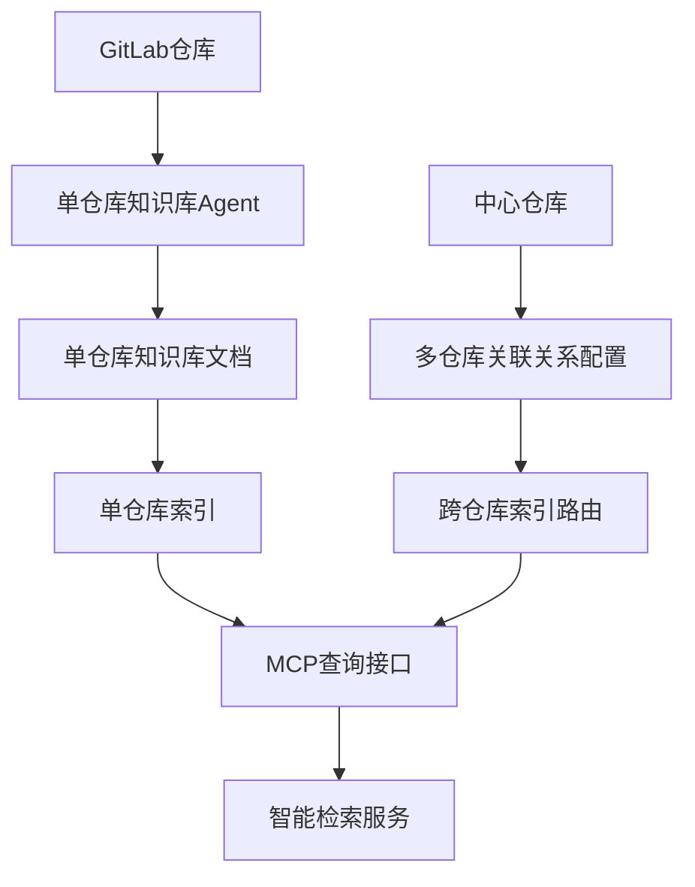

# 索引系统构建架构

## 整体架构设计

基于DeepWiki文档特点，构建分层索引系统：



## 单仓库索引构建

### 仓库与文档关系定义

**文档结构模板**：
- `README.md`: 项目概述和快速开始
- `ARCHITECTURE.md`: 架构分析和组件说明  
- `COMPONENTS.md`: 组件详细说明和依赖关系
- `API.md`: 接口和使用指南
- `WORKFLOWS.md`: 业务流程和数据流

**索引关系模型**：
```typescript
// 文档引用类型定义
interface DocumentRef {
  filePath: string;
  title: string;
  summary: string;
  lastUpdated: string;
}

interface ComponentRef {
  name: string;
  type: string;
  filePath: string;
  dependencies: string[];
  description: string;
}

interface ApiRef {
  name: string;
  method: string;
  endpoint: string;
  filePath: string;
  description: string;
}

interface WorkflowRef {
  name: string;
  steps: string[];
  filePaths: string[];
  description: string;
}

// 单仓库索引主结构
interface SingleRepoIndex {
  repoId: string;
  repoUrl: string;
  branch: string;
  knowledgeBase: {
    overview: DocumentRef;
    architecture: DocumentRef;
    components: ComponentRef[];
    apis: ApiRef[];
    workflows: WorkflowRef[];
  };
  metadata: {
    lastUpdated: string;
    version: string;
    dependencies: string[];
    language: string;
    framework: string[];
  };
}
```

### 知识提取流程

1. **代码结构分析**: 使用Claude Code SDK分析项目架构
2. **文档生成**: 基于分析结果生成结构化文档
3. **关系图谱**: 构建组件依赖关系图
4. **索引构建**: 创建可搜索的文档索引

## 多仓库关联索引

### 中心仓库关系定义

**关系类型**：
- `dependency`: 依赖关系（上游/下游）
- `service`: 服务调用关系
- `shared`: 共享组件关系  
- `domain`: 业务域关联
- `team`: 团队维护关系

**关系配置模型**：
```typescript
// 关系类型枚举
type RelationType = 'dependency' | 'service' | 'shared' | 'domain' | 'team';

// 查询类型枚举  
type QueryType = 'architecture' | 'api' | 'component' | 'workflow' | 'dependency';

// 多仓库关系配置
interface MultiRepoRelation {
  centralRepoId: string;
  relations: {
    repoId: string;
    relationType: RelationType;
    targetRepos: string[];
    weight: number; // 0-1 之间的权重值
    description: string;
    bidirectional: boolean; // 是否双向关系
  }[];
  routingRules: {
    queryType: QueryType;
    targetRepos: string[];
    priority: number; // 1-10 优先级
    conditions?: string[]; // 路由条件
  }[];
  metadata: {
    lastUpdated: string;
    version: string;
    maintainer: string;
  };
}
```

### 路由策略

1. **查询意图识别**: 分析用户查询意图
2. **仓库路由**: 根据关系配置路由到相关仓库
3. **并行检索**: 多仓库并行搜索
4. **结果聚合**: 按相关性和权重排序

## MCP协议集成

### 查询工具定义

**单仓库查询工具**：
- `search-repo-knowledge`: 搜索单仓库知识库
- `get-repo-architecture`: 获取仓库架构信息
- `find-component`: 查找特定组件
- `get-api-docs`: 获取API文档

**跨仓库查询工具**：
- `search-multi-repo`: 跨仓库智能检索
- `find-dependencies`: 查找依赖关系
- `trace-service-calls`: 追踪服务调用链
- `get-domain-overview`: 获取业务域概览

### MCP服务器架构

```typescript
// MCP工具参数和返回类型定义
interface SearchResult {
  repoId: string;
  filePath: string;
  content: string;
  relevance: number;
  type: 'overview' | 'architecture' | 'component' | 'api' | 'workflow';
}

interface Architecture {
  repoId: string;
  overview: string;
  layers: string[];
  components: ComponentRef[];
  dependencies: string[];
  diagrams?: string[]; // mermaid图表
}

interface CrossRepoResult {
  results: SearchResult[];
  relations: string[];
  aggregatedScore: number;
  queryAnalysis: {
    intent: string;
    targetTypes: string[];
    scope: string[];
  };
}

// MCP服务器接口定义
interface MCPServer {
  // 单仓库工具
  singleRepoTools: {
    searchKnowledge(params: {repoId: string, query: string, type?: string}): Promise<SearchResult[]>;
    getArchitecture(params: {repoId: string}): Promise<Architecture>;
    findComponent(params: {repoId: string, componentName: string}): Promise<ComponentRef | null>;
    getApiDocs(params: {repoId: string, apiName?: string}): Promise<ApiRef[]>;
  };
  
  // 多仓库工具
  multiRepoTools: {
    searchAcrossRepos(params: {query: string, scope?: string[], maxResults?: number}): Promise<CrossRepoResult>;
    findDependencies(params: {repoId: string, direction?: 'upstream' | 'downstream' | 'both'}): Promise<string[]>;
    traceServiceCalls(params: {fromRepo: string, toRepo: string}): Promise<string[]>;
    getDomainOverview(params: {domain: string}): Promise<{repos: string[], overview: string}>;
  };
  
  // 工具管理
  management: {
    refreshIndex(params: {repoId?: string}): Promise<{status: string, message: string}>;
    getStatus(): Promise<{activeRepos: number, lastUpdate: string}>;
  };
}
```

## GitLab集成载体

### 知识库存储

**单仓库存储**：
- 知识库文档存储在各仓库的 `docs/knowledge/` 目录
- 索引文件存储在 `.repomind/` 目录

**中心仓库存储**：
- 关系配置存储在专用的中心仓库
- 路径：`repos/relations/` 和 `repos/indexes/`

### Git集成策略

1. **自动触发**: 代码提交后自动更新知识库
2. **增量更新**: 只更新变更部分的文档
3. **版本管理**: 支持多分支的知识库版本
4. **权限控制**: 基于GitLab权限控制访问

## 技术风险与缓解

### 主要技术风险

**Claude Code SDK依赖风险**：
- 风险：API限制、调用配额或SDK接口变更
- 缓解：实现本地缓存机制、降低API调用频率、版本锁定和向后兼容性处理

**大型仓库分析性能风险**：
- 风险：分析时间过长（>10分钟）导致超时
- 缓解：分块分析、增量更新、异步处理和进度反馈

**MCP协议安全风险**：
- 风险：工具权限泄露、prompt注入攻击
- 缓解：严格权限控制、输入验证和沙箱隔离

**GitLab集成权限风险**：
- 风险：仓库访问权限变更或API限制
- 缓解：权限缓存、降级方案和错误重试机制

### 性能指标要求

- 知识提取准确率 > 90%
- 单仓库分析时间 < 10分钟
- 跨仓库查询响应时间 < 5秒
- 系统可用性 > 99%

## 实施建议

1. **分阶段实施**: 先单仓库后多仓库，逐步完善功能
2. **性能监控**: 建立完整的性能监控和告警机制
3. **安全加固**: 重点关注MCP协议的安全防护
4. **用户体验**: 提供清晰的进度反馈和错误提示