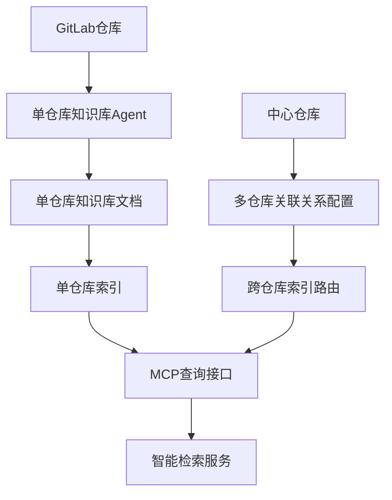

# 索引系统构建架构

## 整体架构设计

基于DeepWiki文档特点，构建分层索引系统：



## 单仓库索引构建

### 仓库与文档关系定义

**文档结构模板**（基于TaskListManager实际实现）：
- `overview.md`: 项目概览文档 - 分析项目整体特征，提供快速理解项目的概览信息
- `system-architecture.md`: 系统架构与组件设计文档 - 分析项目的整体架构设计、核心模式及组件结构
- `api-reference.md`: API接口与数据模型文档 - 分析项目的API设计、接口规范及数据结构模型
- `business-workflows.md`: 业务流程文档 - 分析项目的核心业务流程和处理逻辑

**知识库YAML结构（基于TaskListManager实际实现）**：
```yaml
# 单仓库知识库主入口文件：.repomind/knowledge.yaml
# 基于TaskListManager.generateKnowledgeIndex的实际实现
version: "1.0.0"
repository:
  name: string          # path.basename(config.repoPath)
  path: string          # config.repoPath
  language: string      # 默认 "unknown"
  analysisDepth: string # config.depth
  includeTests: boolean # config.includeTests
generatedAt: string    # 格式化时间戳
analysisConfig:        # 完整的AnalysisConfig对象
  repoPath: string
  outputPath: string
  depth: string
  includeTests: boolean
  includeDocs: boolean
contentIndex:
  overview: "./docs/overview.md"
  systemArchitecture: "./docs/system-architecture.md"
  apiReference: "./docs/api-reference.md"
  businessWorkflows: "./docs/business-workflows.md"
metadata:               # 来自KnowledgeGenerationResult.metadata
  totalTasks: number
  successfulTasks: number
  averageExecutionTime: number
  timestamp: string
qualityMetrics:
  overallConfidence: number    # 平均置信度
  successfulTasks: number
  totalTasks: number
```

**TypeScript接口定义（对应实际KnowledgeIndex实现）**：
```typescript
// 基于TaskListManager.generateKnowledgeIndex的实际接口定义
interface KnowledgeIndex {
  version: string;
  repository: {
    name: string;           // path.basename(config.repoPath)
    path: string;           // config.repoPath
    language: string;       // 默认 "unknown"
    analysisDepth: string;  // config.depth
    includeTests: boolean;  // config.includeTests
  };
  generatedAt: string;      // 格式化时间戳
  analysisConfig: AnalysisConfig;  // 完整配置对象
  contentIndex: {
    overview: string;           // "./docs/overview.md"
    systemArchitecture: string; // "./docs/system-architecture.md"
    apiReference: string;       // "./docs/api-reference.md"
    businessWorkflows: string;  // "./docs/business-workflows.md"
  };
  metadata: {
    totalTasks: number;
    successfulTasks: number;
    averageExecutionTime: number;
    timestamp: string;
  };
  qualityMetrics: {
    overallConfidence: number;  // 平均置信度
    successfulTasks: number;
    totalTasks: number;
  };
}

// 分析配置接口
interface AnalysisConfig {
  repoPath: string;
  outputPath: string;
  depth: string;
  includeTests: boolean;
  includeDocs: boolean;
  // 其他配置字段...
}
```

### 知识提取流程（基于TaskListManager实际实现）

1. **统一prompt构建**: 将所有分析任务合并为单个comprehensive prompt
2. **单次SDK调用**: 使用Claude Code SDK执行完整分析（2小时超时）
3. **实时任务检测**: 监控输出流，检测任务完成标记并实时写入文档
4. **兜底机制**: 处理未实时写入的任务，使用多种解析策略
5. **质量验证**: 计算置信度、完整性检查和结果打包
6. **知识库更新**: 生成knowledge.yaml主索引文件

## 多仓库关联索引

### 中心仓库关系定义

**关系类型**：
- `dependency`: 依赖关系（上游/下游）
- `service`: 服务调用关系
- `shared`: 共享组件关系  
- `domain`: 业务域关联
- `team`: 团队维护关系

**多仓库关系YAML结构（基于repo-relationships.yaml规范）**：
```yaml
# 多仓库关系配置文件：.repomind/meta/repo-relationships.yaml
version: "1.0"
schema_version: "1.0"

current_repository:
  name: string
  url: string
  type: string  # primary/secondary/utility
  domain: string

related_repositories:
  dependencies:
    - name: string
      url: string
      relationship_type: string
      dependency_level: string  # critical/important/optional
      version_constraint: string
      description: string
      interface_points: []
      confidence: number
      last_verified: string
  
  dependents:
    - name: string
      url: string
      relationship_type: string
      dependency_level: string
      description: string
      interface_points: []
      confidence: number
      
  collaborators:
    - name: string
      url: string
      relationship_type: string
      collaboration_pattern: string  # event_driven/sync_api/async_queue
      description: string
      interface_points: []
      confidence: number

architecture_mapping:
  service_mesh:
    role: string  # core_service/edge_service/utility_service
    cluster: string
    namespace: string
  data_flow:
    upstream_services: []
    downstream_services: []
    data_stores: []
  deployment_topology:
    environment: string
    scaling_group: string
    load_balancer: string

shared_resources:
  databases:
    - name: string
      type: string
      shared_with: []
      access_pattern: string
  message_queues:
    - name: string
      type: string
      shared_with: []
      access_pattern: string
  configuration:
    - name: string
      type: string
      shared_with: []
      access_pattern: string

update_strategy:
  sync_frequency: string  # real_time/hourly/daily/weekly
  auto_discovery: boolean
  manual_verification: boolean
  confidence_threshold: number

metadata:
  created_at: string
  updated_at: string
  created_by: string
  validation_status: string
  total_relationships: number
  high_confidence_relationships: number
```

**TypeScript接口定义（与repo-relationships.yaml对应）**：
```typescript
// 多仓库关系接口定义，完全对应repo-relationships.yaml结构
interface RepoRelationships {
  version: string;
  schema_version: string;
  current_repository: {
    name: string;
    url: string;
    type: 'primary' | 'secondary' | 'utility';
    domain: string;
  };
  related_repositories: {
    dependencies: RepoRelation[];
    dependents: RepoRelation[];
    collaborators: RepoRelation[];
  };
  architecture_mapping: {
    service_mesh: {
      role: 'core_service' | 'edge_service' | 'utility_service';
      cluster: string;
      namespace: string;
    };
    data_flow: {
      upstream_services: string[];
      downstream_services: string[];
      data_stores: string[];
    };
    deployment_topology: {
      environment: string;
      scaling_group: string;
      load_balancer: string;
    };
  };
  shared_resources: {
    databases: SharedResource[];
    message_queues: SharedResource[];
    configuration: SharedResource[];
  };
  update_strategy: {
    sync_frequency: 'real_time' | 'hourly' | 'daily' | 'weekly';
    auto_discovery: boolean;
    manual_verification: boolean;
    confidence_threshold: number;
  };
  metadata: {
    created_at: string;
    updated_at: string;
    created_by: string;
    validation_status: string;
    total_relationships: number;
    high_confidence_relationships: number;
  };
}

interface RepoRelation {
  name: string;
  url: string;
  relationship_type: string;
  dependency_level?: 'critical' | 'important' | 'optional';
  version_constraint?: string;
  collaboration_pattern?: 'event_driven' | 'sync_api' | 'async_queue';
  description: string;
  interface_points: string[];
  confidence: number;
  last_verified?: string;
}

interface SharedResource {
  name: string;
  type: string;
  shared_with: string[];
  access_pattern: string;
}
```

### 路由策略

1. **查询意图识别**: 分析用户查询意图
2. **仓库路由**: 根据关系配置路由到相关仓库
3. **并行检索**: 多仓库并行搜索
4. **结果聚合**: 按相关性和权重排序

## MCP协议集成

### 查询工具定义

**单仓库查询工具**：
- `search-repo-knowledge`: 搜索单仓库知识库
- `get-repo-architecture`: 获取仓库架构信息
- `find-component`: 查找特定组件
- `get-api-docs`: 获取API文档

**跨仓库查询工具**：
- `search-multi-repo`: 跨仓库智能检索
- `find-dependencies`: 查找依赖关系
- `trace-service-calls`: 追踪服务调用链
- `get-domain-overview`: 获取业务域概览

### MCP服务器架构（基于统一YAML结构）

```typescript
// MCP工具参数和返回类型定义（对应knowledge.yaml结构）
interface SearchResult {
  repoId: string;
  filePath: string;
  content: string;
  relevance: number;
  type: 'overview' | 'system_architecture' | 'api_reference' | 'business_workflows';
  entity?: EntityRef;  // 如果匹配到实体
  concept?: ConceptRef;  // 如果匹配到概念
}

interface KnowledgeBaseResult {
  repoId: string;
  knowledgeBase: KnowledgeBase;  // 完整的knowledge.yaml结构
  contentIndex: {
    overview: string;
    systemArchitecture: string;
    apiReference: string;
    businessWorkflows: string;
  };
}

interface CrossRepoResult {
  results: SearchResult[];
  repoRelationships: RepoRelationships[];  // 对应repo-relationships.yaml
  aggregatedScore: number;
  queryAnalysis: {
    intent: string;
    targetTypes: string[];
    scope: string[];
    matchedEntities: EntityRef[];
    matchedConcepts: ConceptRef[];
  };
}

// MCP服务器接口定义（与YAML结构完全对应）
interface MCPServer {
  // 单仓库工具
  singleRepoTools: {
    // 搜索知识库（基于knowledge.yaml的知识图谱）
    searchKnowledge(params: {
      repoId: string, 
      query: string, 
      type?: 'entity' | 'concept' | 'document' | 'all'
    }): Promise<SearchResult[]>;
    
    // 获取完整知识库结构
    getKnowledgeBase(params: {repoId: string}): Promise<KnowledgeBaseResult>;
    
    // 查找实体（基于knowledge_graph.entities）
    findEntity(params: {
      repoId: string, 
      entityName: string, 
      entityType?: string
    }): Promise<EntityRef | null>;
    
    // 查找概念（基于knowledge_graph.concepts）
    findConcept(params: {
      repoId: string, 
      conceptName: string
    }): Promise<ConceptRef | null>;
    
    // 获取关系图（基于knowledge_graph.relationships）
    getRelationships(params: {
      repoId: string, 
      entityId?: string, 
      relationshipType?: string
    }): Promise<RelationshipRef[]>;
    
    // 获取文档内容（基于content_index）
    getDocument(params: {
      repoId: string, 
      documentType: 'overview' | 'systemArchitecture' | 'apiReference' | 'businessWorkflows'
    }): Promise<{filePath: string, content: string}>;
  };
  
  // 多仓库工具（基于repo-relationships.yaml）
  multiRepoTools: {
    // 跨仓库搜索
    searchAcrossRepos(params: {
      query: string, 
      scope?: string[], 
      maxResults?: number,
      includeRelationships?: boolean
    }): Promise<CrossRepoResult>;
    
    // 查找仓库依赖关系
    findDependencies(params: {
      repoId: string, 
      direction?: 'dependencies' | 'dependents' | 'collaborators' | 'all'
    }): Promise<RepoRelation[]>;
    
    // 追踪服务调用链（基于architecture_mapping）
    traceServiceCalls(params: {
      fromRepo: string, 
      toRepo: string,
      includeSharedResources?: boolean
    }): Promise<{
      path: string[], 
      sharedResources: SharedResource[],
      architectureMapping: any
    }>;
    
    // 获取业务域概览
    getDomainOverview(params: {domain: string}): Promise<{
      repos: RepoRelationships[], 
      overview: string,
      architectureMapping: any
    }>;
    
    // 获取仓库关系配置
    getRepoRelationships(params: {repoId: string}): Promise<RepoRelationships>;
  };
  
  // 工具管理
  management: {
    refreshIndex(params: {repoId?: string}): Promise<{status: string, message: string}>;
    getStatus(): Promise<{
      activeRepos: number, 
      lastUpdate: string,
      validationStatus: {[repoId: string]: boolean}
    }>;
    validateKnowledgeBase(params: {repoId: string}): Promise<{
      schema_valid: boolean,
      content_complete: boolean,
      cross_references_valid: boolean,
      errors: string[]
    }>;
  };
}
```

## GitLab集成载体

### 知识库存储

**单仓库存储**：
- 知识库文档存储在各仓库的 `.repomind/docs/` 目录
- 索引和元数据存储在 `.repomind/` 目录结构中

**中心仓库存储**：
- 关系配置存储在专用的中心仓库
- 路径：`repos/relations/` 和 `repos/indexes/`

### Git集成策略

1. **自动触发**: 代码提交后自动更新知识库
2. **增量更新**: 只更新变更部分的文档
3. **版本管理**: 支持多分支的知识库版本
4. **权限控制**: 基于GitLab权限控制访问

## 技术风险与缓解

### 主要技术风险

**Claude Code SDK依赖风险**：
- 风险：API限制、调用配额或SDK接口变更
- 缓解：实现本地缓存机制、降低API调用频率、版本锁定和向后兼容性处理

**大型仓库分析性能风险**：
- 风险：分析时间过长（>10分钟）导致超时
- 缓解：分块分析、增量更新、异步处理和进度反馈

**MCP协议安全风险**：
- 风险：工具权限泄露、prompt注入攻击
- 缓解：严格权限控制、输入验证和沙箱隔离

**GitLab集成权限风险**：
- 风险：仓库访问权限变更或API限制
- 缓解：权限缓存、降级方案和错误重试机制

### 性能指标要求

- 知识提取准确率 > 90%
- 单仓库分析时间 < 10分钟
- 跨仓库查询响应时间 < 5秒
- 系统可用性 > 99%

## 实施建议

1. **分阶段实施**: 先单仓库后多仓库，逐步完善功能
2. **性能监控**: 建立完整的性能监控和告警机制
3. **安全加固**: 重点关注MCP协议的安全防护
4. **用户体验**: 提供清晰的进度反馈和错误提示