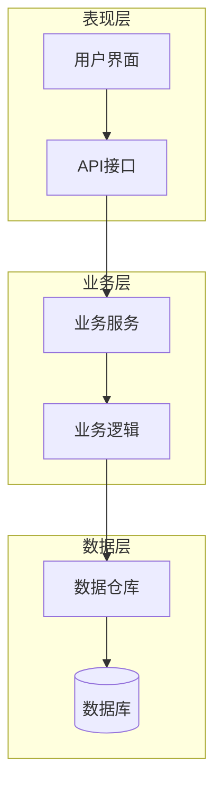
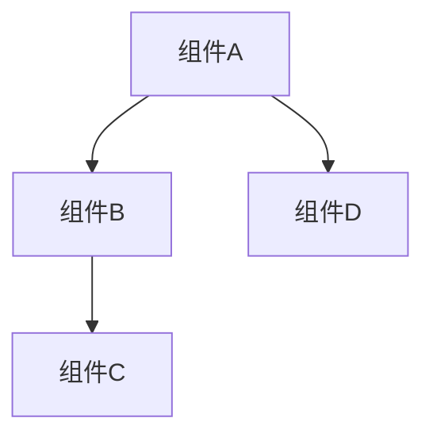
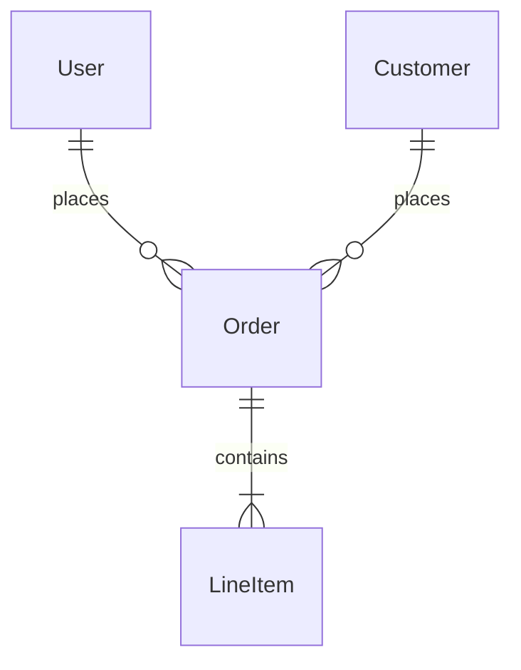
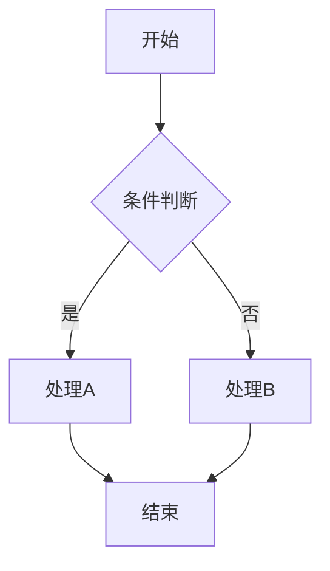
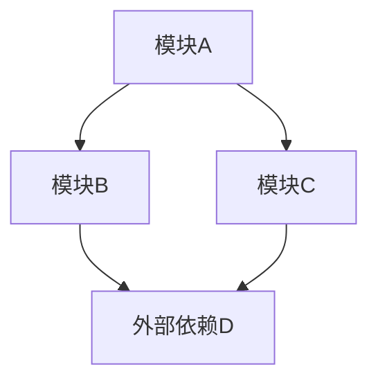

# 单仓库知识库规范文档

## 1. 概述

本文档定义了RepoMind系统中单仓库知识库的结构化生成、存储和查询规范。该规范基于DeepWiki的核心理念，结合Claude Code的智能分析能力，为代码仓库生成结构化的维基式知识库。

## 2. 知识库结构

### 2.1 目录结构

```
.repomind/
├── knowledge.yaml              # 结构化知识库数据（主要入口文件）
├── meta/                       # 元数据目录
│   ├── repo-info.yaml         # 仓库基础信息
│   ├── analysis-config.yaml   # 分析配置记录
│   ├── generation-log.yaml    # 生成过程日志
│   └── repo-relationships.yaml # 多仓库关联关系（新增）
├── docs/                       # 维基式文档目录
│   ├── overview.md            # 项目概览文档
│   ├── architecture.md        # 系统架构文档（内嵌架构图表）
│   ├── components.md          # 组件设计文档（内嵌组件关系图表）
│   ├── apis.md                # API接口文档
│   ├── data-models.md         # 数据模型文档（内嵌数据流图表）
│   ├── workflows.md           # 业务流程文档（内嵌工作流图表）
│   └── dependencies.md        # 依赖关系文档（内嵌依赖关系图表）
└── knowledge-base/             # 分类知识库目录
    ├── core/                  # 核心概念知识
    ├── patterns/              # 设计模式知识
    ├── best-practices/        # 最佳实践知识
    └── troubleshooting/       # 故障排除知识
```

### 2.2 核心文件说明

#### knowledge.yaml（主要入口文件）
这是知识库的核心索引文件，包含以下结构：

```yaml
version: "1.0.0"
schema_version: "1.0"
repository:
  name: "project-name"
  path: "/path/to/repo"
  url: "https://gitlab.com/org/project"
  language: "typescript"
  framework: "react"
  commit_hash: "abc123def456"
  branch: "main"
generated_at: "2024-09-10T10:00:00Z"
last_updated: "2024-09-10T10:00:00Z"
claude_code_version: "1.2.0"
analysis_config:
  depth: "deep"
  include_tests: true
  include_docs: true
  max_turns: 3
  batch_processing: true
  parallel_analysis: true
  optimization_strategy: "quality_first"
  tools_allowed: ["Read", "Grep", "Glob", "Edit", "Write"]
  context_compression: true
knowledge_graph:
  entities:
    - id: string              # 实体唯一标识
      name: string            # 实体名称
      type: string            # 实体类型：class/function/interface/component
      description: string     # 实体描述
      file_path: string       # 所在文件路径
      line_number: number     # 所在行号
      complexity: number      # 复杂度评分
      importance: number      # 重要性评分 (0-1)
  relationships:
    - id: string              # 关系唯一标识
      from_entity: string     # 源实体ID
      to_entity: string       # 目标实体ID
      relationship_type: string # 关系类型：depends_on/implements/extends/calls
      description: string     # 关系描述
      strength: number        # 关系强度 (0-1)
  concepts:
    - id: string              # 概念唯一标识
      name: string            # 概念名称
      definition: string      # 概念定义
      context: string         # 使用上下文
      related_entities: []    # 相关实体ID列表
      importance: number      # 重要性评分 (0-1)
metrics:
  complexity_score: number        # 整体复杂度评分
  maintainability_index: number   # 可维护性指数
  test_coverage: number          # 测试覆盖率
  documentation_coverage: number # 文档覆盖率
  lines_of_code: number         # 代码行数
  files_analyzed: number        # 分析文件数量
content_index:
  overview: "./docs/overview.md"
  architecture: "./docs/architecture.md"
  components: "./docs/components.md"
  apis: "./docs/apis.md"
  data_models: "./docs/data-models.md"
  workflows: "./docs/workflows.md"
  dependencies: "./docs/dependencies.md"
validation:
  schema_valid: true
  content_complete: true
  cross_references_valid: true
  last_validation: "2024-09-10T10:00:00Z"
```

## 3. 文档生成规范

### 3.1 项目概览文档 (overview.md)

**生成要求:**
- 项目的核心目标和价值主张
- 主要功能特性列表
- 技术栈概览
- 项目规模和复杂度分析
- 关键业务概念定义

**结构模板:**
```markdown
# 项目概览：[项目名称]

## 项目简介
[项目的核心目标和价值主张]

## 核心特性
- 特性1：[描述]
- 特性2：[描述]
- ...

## 技术栈
[技术栈信息，使用表格形式展示]

## 架构概览
[高层架构描述，包含架构图表]

## 关键概念
[业务域关键概念定义]

## 快速开始
[如何快速理解和上手项目]
```

### 3.2 系统架构文档 (architecture.md)

**生成要求:**
- 系统整体架构模式识别
- 分层架构详细描述
- 核心组件职责划分
- 组件间交互关系
- 架构决策记录

**结构模板:**
```markdown
# 系统架构

## 架构模式
[识别的架构模式：MVC、Clean Architecture、微服务等]

## 系统分层
[详细的分层结构描述]

## 核心组件
[各组件的职责和边界]

## 交互关系
[组件间如何协作]

## 架构图

[架构图详细说明和各层职责描述]

## 设计原则
[遵循的设计原则]

## 架构决策记录
[重要的架构决策和原因]
```

### 3.3 组件设计文档 (components.md)

**生成要求:**
- 自动识别项目中的关键组件
- 每个组件的职责、接口和实现概览
- 组件间的依赖关系
- 组件的生命周期管理
- 内嵌组件关系图表

**结构模板:**
```markdown
# 组件设计

## 组件概览
[项目中核心组件的整体说明]

## 组件列表
### 组件A
- **职责**: [组件职责描述]
- **接口**: [对外接口说明]
- **依赖**: [依赖的其他组件]

### 组件B
[类似结构]

## 组件关系图

[组件关系详细说明]
```

### 3.4 API接口文档 (apis.md)

**生成要求:**
- 自动发现和提取API接口定义
- REST API、GraphQL、WebSocket等不同类型API的统一描述
- 接口分组和版本管理
- 请求响应示例

### 3.5 数据模型文档 (data-models.md)

**生成要求:**
- 核心数据实体识别
- 实体关系图（ERD）
- 数据流向分析
- 数据持久化策略
- 内嵌数据流图表

**结构模板:**
```markdown
# 数据模型

## 核心实体
[数据实体概览说明]

### 实体A
- **属性**: [实体属性列表]
- **关系**: [与其他实体的关系]
- **约束**: [数据约束条件]

## 实体关系图

[实体关系详细说明]

## 数据流图

[数据流向分析和说明]
```

### 3.6 业务流程文档 (workflows.md)

**生成要求:**
- 关键业务流程识别
- 流程步骤详细描述
- 异常处理流程
- 内嵌工作流图表

**结构模板:**
```markdown
# 业务流程

## 流程概览
[业务流程整体说明]

## 核心流程
### 流程A：[流程名称]
**流程描述**: [流程目标和作用]
**参与角色**: [涉及的角色]
**流程步骤**:
1. [步骤1描述]
2. [步骤2描述]
3. [步骤3描述]

## 工作流图

[工作流图详细说明]

## 异常处理
[异常情况和处理方式]
```

### 3.7 依赖关系文档 (dependencies.md)

**生成要求:**
- 模块依赖关系分析
- 外部依赖说明
- 循环依赖检测
- 内嵌依赖关系图表

**结构模板:**
```markdown
# 依赖关系

## 依赖概览
[项目依赖整体说明]

## 内部依赖
[模块间依赖关系]

## 外部依赖
[第三方库和服务依赖]

## 依赖关系图

[依赖关系详细说明和影响分析]
```

## 4. 可视化图表规范

### 4.1 图表集成要求

所有图表直接内嵌在对应的文档中，不再单独存储：

1. **架构图** - 集成在 `architecture.md` 中
   - 系统整体架构图表
   - 分层结构图表
   - 组件关系图表

2. **组件关系图** - 集成在 `components.md` 中
   - 组件依赖关系图表
   - 组件交互图表

3. **数据模型图** - 集成在 `data-models.md` 中
   - 实体关系图（ERD）
   - 数据流图表

4. **工作流图** - 集成在 `workflows.md` 中
   - 业务流程图表
   - 决策流程图表

5. **依赖关系图** - 集成在 `dependencies.md` 中
   - 模块依赖图表
   - 外部依赖图表

### 4.2 图表标准化格式

每个文档中的图表应遵循以下格式：

1. **图表位置** - 在相关文字说明之后
2. **图表标题** - 使用二级或三级标题
3. **图表代码** - 使用标准的Mermaid代码块格式
4. **图表说明** - 图表后提供详细解释

**标准格式：**
```markdown
## [图表标题]
```mermaid
[图表代码]
```
[图表详细说明和元素解释]
```

## 5. Claude Code SDK集成规范

### 5.1 analysis-config.yaml 详细配置

```yaml
# analysis-config.yaml - Claude Code SDK集成配置
version: "1.0"
claude_code_integration:
  # SDK基础配置
  sdk_version: "1.2.0"
  api_endpoint: "https://api.anthropic.com"
  timeout_ms: 300000
  
  # 对话轮次优化配置
  conversation_config:
    max_turns: 3                    # 最大对话轮次
    batch_processing: true          # 启用批量处理
    parallel_analysis: true         # 启用并行分析
    optimization_strategy: "quality_first"  # 优化策略: quality_first/speed_first/balanced
    
  # 工具配置
  tools_config:
    allowed_tools: ["Read", "Grep", "Glob", "Edit", "Write", "MultiEdit"]
    disallowed_tools: ["WebSearch", "WebFetch"]  # 禁用不必要的工具
    tool_timeout_ms: 60000
    
  # 上下文管理配置
  context_config:
    context_compression: true       # 启用上下文压缩
    max_context_files: 50          # 最大上下文文件数
    context_window_size: 200000    # 上下文窗口大小
    smart_sampling: true           # 智能采样
    
  # 性能优化配置
  performance_config:
    incremental_analysis: true     # 启用增量分析
    cache_enabled: true           # 启用缓存
    cache_ttl_hours: 24          # 缓存过期时间
    parallel_workers: 4          # 并行工作线程数
    
# 文档生成策略配置
generation_strategy:
  # 分阶段生成策略
  phases:
    - name: "structure_analysis"
      max_turns: 1
      focus: "repository_structure"
      output: "basic_structure"
      
    - name: "content_generation"
      max_turns: 2
      focus: "detailed_documentation"
      depends_on: ["structure_analysis"]
      output: "complete_docs"
      
    - name: "quality_enhancement"
      max_turns: 1
      focus: "diagrams_and_validation"
      depends_on: ["content_generation"]
      output: "enhanced_docs"
      
  # 模板驱动配置
  template_config:
    use_templates: true
    template_priority: "high"      # high/medium/low
    custom_templates_path: "./templates/"
    fallback_to_default: true
    
# 错误处理配置
error_handling:
  retry_config:
    max_retries: 3
    retry_delay_ms: 5000
    exponential_backoff: true
    
  fallback_strategies:
    - "reduce_context_size"
    - "disable_parallel_processing"
    - "use_simplified_templates"
    
  error_recovery:
    auto_recovery: true
    manual_intervention_threshold: 5
    log_errors: true
```

### 5.2 Claude Code集成最佳实践

1. **分阶段处理策略**
   - 阶段1：仓库结构分析 (maxTurns: 1)
   - 阶段2：详细文档生成 (maxTurns: 2)
   - 阶段3：质量提升与验证 (maxTurns: 1)

2. **上下文优化策略**
   - 使用context_compression减少上下文占用
   - 智能采样核心文件和组件
   - 批量处理相关文件

3. **工具优化策略**
   - 禁用不必要的工具减少干扰
   - 优先使用Read、Grep、Glob等高效工具
   - 设置合理的工具超时时间

## 6. 知识提取策略

### 6.1 智能代码分析

基于Claude Code的能力，实现以下智能分析：

1. **语义理解分析**
   - 不仅分析语法结构，更要理解代码的语义意图
   - 识别设计模式和架构模式
   - 理解业务逻辑和领域概念

2. **上下文关联分析**
   - 分析文件间的逻辑关联
   - 理解配置文件对代码行为的影响
   - 关联测试文件和实现文件

3. **演进历史分析**
   - 分析Git历史，理解代码演进过程
   - 识别核心模块和稳定接口
   - 发现代码热点和变更频率

### 6.2 知识抽象层次

定义不同抽象层次的知识提取：

1. **概念层（What）**
   - 项目做什么
   - 解决什么问题
   - 核心价值是什么

2. **结构层（How）**
   - 如何组织代码
   - 如何实现功能
   - 如何处理数据

3. **实现层（Details）**
   - 具体的算法和数据结构
   - 性能优化细节
   - 错误处理机制

## 7. 知识库更新策略

### 7.1 增量更新机制

1. **变更检测**
   - 基于Git diff检测文件变更
   - 分析变更影响范围
   - 确定需要更新的知识模块

2. **智能合并**
   - 保持人工修订的内容
   - 智能合并自动生成的更新
   - 处理冲突和版本管理

3. **一致性检查**
   - 确保图表和文档的一致性
   - 验证交叉引用的有效性
   - 检查知识库的完整性

### 7.2 版本管理

1. **语义化版本控制**
   - 主版本：架构重大变更
   - 次版本：新增功能模块
   - 补丁版本：细节修复和优化

2. **变更日志**
   - 记录每次更新的内容
   - 标记变更的影响范围
   - 提供回滚能力

## 8. generation-log.yaml 错误处理和验证规范

### 8.1 generation-log.yaml 结构定义

```yaml
# generation-log.yaml - 生成过程日志和错误处理
version: "1.0"
generation_session:
  session_id: string              # 生成会话唯一标识
  started_at: "2024-09-10T10:00:00Z"
  completed_at: "2024-09-10T10:30:00Z"
  total_duration_ms: 1800000
  status: "completed"             # completed/failed/partial/in_progress
  
# 阶段执行日志
phase_logs:
  - phase_name: "structure_analysis"
    started_at: "2024-09-10T10:00:00Z"
    completed_at: "2024-09-10T10:05:00Z"
    duration_ms: 300000
    turns_used: 1
    max_turns_allowed: 1
    status: "completed"
    output_files: ["overview.md"]
    
  - phase_name: "content_generation"
    started_at: "2024-09-10T10:05:00Z"
    completed_at: "2024-09-10T10:25:00Z"
    duration_ms: 1200000
    turns_used: 2
    max_turns_allowed: 2
    status: "completed"
    output_files: ["architecture.md", "components.md", "apis.md"]
    
# 错误处理日志
error_handling:
  validation_errors:
    - error_type: "yaml_format_error"
      file_path: "./knowledge.yaml"
      line_number: 45
      message: "缺少必需字段: entities.id"
      severity: "error"
      resolved: true
      resolution_action: "auto_fix_schema"
      occurred_at: "2024-09-10T10:10:00Z"
      
  generation_failures:
    - phase: "content_generation"
      component: "architecture.md"
      error_code: "MAX_TURNS_EXCEEDED"
      message: "超过最大对话轮次限制"
      retry_count: 2
      final_status: "partial_success"
      fallback_applied: "simplified_template"
      occurred_at: "2024-09-10T10:15:00Z"
      
  recovery_actions:
    - action_type: "context_compression"
      applied_at: "2024-09-10T10:16:00Z"
      success: true
      impact: "减少上下文占用50%"
      
    - action_type: "fallback_template"
      applied_at: "2024-09-10T10:17:00Z"
      success: true
      impact: "使用简化模板继续生成"
      
# 性能指标
performance_metrics:
  total_files_analyzed: 156
  total_lines_processed: 45678
  avg_processing_speed: 1234      # 行/秒
  context_compression_ratio: 0.6  # 压缩比率
  cache_hit_rate: 0.75           # 缓存命中率
  
# 质量指标  
quality_metrics:
  validation_score: 0.95         # 验证分数 (0-1)
  completeness_score: 0.88       # 完整性分数 (0-1)
  consistency_score: 0.92        # 一致性分数 (0-1)
  documentation_coverage: 0.85   # 文档覆盖率 (0-1)
  
# 自动化检查结果
automated_checks:
  link_validation:
    total_links: 23
    valid_links: 21
    broken_links: 2
    external_links_checked: 5
    
  content_consistency:
    terminology_consistency: 0.94
    cross_reference_validity: 0.89
    diagram_consistency: 0.91
    
  schema_validation:
    yaml_files_checked: 4
    schema_violations: 1
    auto_fixes_applied: 1
    manual_fixes_required: 0
```

### 8.2 自动化验证机制

1. **YAML格式验证**
   - Schema格式检查
   - 必需字段验证
   - 数据类型验证

2. **内容一致性检查**
   - 交叉引用有效性
   - 术语使用一致性
   - 图表引用完整性

3. **质量保证检查**
   - 文档完整性评估
   - 可读性分数计算
   - 信息准确性验证

## 9. 查询和检索规范

### 9.1 查询接口定义

```yaml
# 查询接口配置
knowledge_query:
  query: string                    # 自然语言查询
  scope:                          # 查询范围
    - overview
    - architecture 
    - api
    - components
    - workflows
    - dependencies
    - all
  depth:                          # 查询深度
    - shallow
    - normal 
    - deep
  format:                         # 返回格式
    - summary
    - detailed
    - reference

# 返回结果配置
knowledge_result:
  answer: string                  # 主要答案
  confidence: number              # 置信度 (0-1)
  sources: []                     # 信息来源
  related_concepts: []            # 相关概念
  suggested_queries: []           # 建议的后续查询
```

### 9.2 语义检索能力

1. **概念映射**
   - 建立代码实体与业务概念的映射
   - 支持同义词和相关词查询
   - 处理技术术语的多样化表达

2. **上下文理解**
   - 理解查询的上下文和意图
   - 提供精准的答案匹配
   - 支持复合查询和关联查询

## 10. 质量保证规范

### 10.1 内容质量标准

1. **准确性**
   - 确保生成的文档与代码实现一致
   - 定期验证文档的时效性
   - 消除歧义和矛盾信息

2. **完整性**
   - 覆盖项目的核心功能和组件
   - 包含必要的使用说明和示例
   - 提供足够的上下文信息

3. **可读性**
   - 使用清晰、简洁的语言
   - 适当的结构化和格式化
   - 提供必要的图表和示例

### 10.2 自动化检查

1. **链接有效性检查**
   - 验证文档间的交叉引用
   - 检查图表引用的有效性
   - 确保外部链接的可访问性

2. **内容一致性检查**
   - 检查术语使用的一致性
   - 验证数据模型的一致性
   - 确保架构描述的一致性

## 11. 多仓库关联规范

### 11.1 repo-relationships.yaml 结构定义

```yaml
# repo-relationships.yaml - 多仓库关联关系定义
version: "1.0"
schema_version: "1.0"

# 当前仓库信息
current_repository:
  name: "project-core"
  url: "https://gitlab.com/org/project-core"
  type: "primary"               # primary/secondary/utility
  domain: "backend-services"    # 业务域
  
# 关联仓库列表
related_repositories:
  # 依赖关系
  dependencies:
    - name: "shared-utils"
      url: "https://gitlab.com/org/shared-utils"
      relationship_type: "runtime_dependency"
      dependency_level: "critical"     # critical/important/optional
      version_constraint: "^2.1.0"
      description: "共享工具库，提供基础功能"
      interface_points:
        - "utils/logger"
        - "utils/config"
        - "utils/validation"
      confidence: 0.95
      last_verified: "2024-09-10T10:00:00Z"
      
  # 被依赖关系  
  dependents:
    - name: "web-frontend"
      url: "https://gitlab.com/org/web-frontend"
      relationship_type: "api_consumer"
      dependency_level: "critical"
      description: "前端应用，消费核心API服务"
      interface_points:
        - "api/v1/users"
        - "api/v1/orders"
        - "api/v1/payments"
      confidence: 0.98
      
  # 协作关系
  collaborators:
    - name: "notification-service"
      url: "https://gitlab.com/org/notification-service"
      relationship_type: "service_integration"
      collaboration_pattern: "event_driven"  # event_driven/sync_api/async_queue
      description: "通知服务，处理系统通知"
      interface_points:
        - "events/user_registered"
        - "events/order_completed"
      confidence: 0.87
      
# 架构关系映射
architecture_mapping:
  service_mesh:
    role: "core_service"          # core_service/edge_service/utility_service
    cluster: "backend-cluster"
    namespace: "production"
    
  data_flow:
    upstream_services: ["auth-service", "user-service"]
    downstream_services: ["notification-service", "audit-service"]
    data_stores: ["postgres-main", "redis-cache"]
    
  deployment_topology:
    environment: "production"
    scaling_group: "core-services"
    load_balancer: "internal-lb"
    
# 共享资源定义
shared_resources:
  databases:
    - name: "postgres-main"
      type: "postgresql"
      shared_with: ["user-service", "order-service"]
      access_pattern: "read_write"
      
  message_queues:
    - name: "rabbitmq-events"
      type: "rabbitmq"
      shared_with: ["notification-service", "audit-service"]
      access_pattern: "publisher"
      
  configuration:
    - name: "config-server"
      type: "spring_config"
      shared_with: ["all_services"]
      access_pattern: "consumer"
      
# 更新策略
update_strategy:
  sync_frequency: "daily"        # real_time/hourly/daily/weekly
  auto_discovery: true          # 自动发现新关系
  manual_verification: true     # 需要人工验证
  confidence_threshold: 0.8     # 自动接受的置信度阈值
  
# 元数据
metadata:
  created_at: "2024-09-10T10:00:00Z"
  updated_at: "2024-09-10T10:00:00Z"
  created_by: "repomind-system"
  validation_status: "valid"
  total_relationships: 8
  high_confidence_relationships: 6
```

### 11.2 多仓库关联的发现策略

1. **静态分析发现**
   - 依赖文件分析 (package.json, requirements.txt)
   - 配置文件分析 (docker-compose.yml, k8s manifests)
   - API文档分析 (OpenAPI, GraphQL schemas)

2. **动态关系推断**
   - Git提交历史分析
   - CI/CD Pipeline分析
   - 部署拓扑分析

3. **人工标注机制**
   - 支持手动添加关系
   - 提供验证和校正接口
   - 保持人工标注的優先级

## 12. 扩展和定制

### 12.1 自定义规则配置

允许用户根据项目特点自定义知识库生成规则：

```yaml
# 自定义规则配置
version: "1.0"

# 组件识别模式
component_patterns:
  services:
    - pattern: "*Service.ts"
      priority: "high"
      weight: 0.9
      category: "service_layer"
      description: "业务服务类"
    - pattern: "**/*Service.js"
      priority: "high"
      weight: 0.8
      category: "service_layer"
      description: "JavaScript服务模块"
      
  controllers:
    - pattern: "*Controller.ts"
      priority: "high"
      weight: 0.95
      category: "api_layer"
      description: "API控制器类"
    - pattern: "**/controllers/**/*.ts"
      priority: "medium"
      weight: 0.7
      category: "api_layer"
      description: "控制器目录下的文件"
      
  models:
    - pattern: "**/models/**/*.ts"
      priority: "high"
      weight: 0.85
      category: "data_layer"
      description: "数据模型定义"
    - pattern: "**/entities/**/*.ts"
      priority: "high"
      weight: 0.85
      category: "data_layer"
      description: "数据实体定义"
      
  utilities:
    - pattern: "**/utils/**/*.ts"
      priority: "medium"
      weight: 0.6
      category: "utility_layer"
      description: "工具函数和帮助类"
      
# API接口识别模式      
api_patterns:
  rest_apis:
    - pattern: "**/routes/**/*.ts"
      priority: "high"
      weight: 0.9
      category: "rest_api"
      api_type: "express_route"
      description: "Express路由定义"
    - pattern: "**/api/**/*.ts"
      priority: "high"
      weight: 0.85
      category: "rest_api"
      api_type: "generic"
      description: "通用API接口"
      
  graphql_apis:
    - pattern: "**/*.graphql"
      priority: "high"
      weight: 0.95
      category: "graphql_api"
      api_type: "schema"
      description: "GraphQL Schema定义"
    - pattern: "**/resolvers/**/*.ts"
      priority: "high"
      weight: 0.9
      category: "graphql_api"
      api_type: "resolver"
      description: "GraphQL Resolver"
      
# 配置文件模式
config_patterns:
  - pattern: "*.json"
    priority: "medium"
    weight: 0.6
    category: "configuration"
    config_type: "json"
    description: "JSON配置文件"
  - pattern: "*.yaml"
    priority: "medium"
    weight: 0.6
    category: "configuration"
    config_type: "yaml"
    description: "YAML配置文件"
  - pattern: "docker-compose*.yml"
    priority: "high"
    weight: 0.8
    category: "deployment"
    config_type: "docker_compose"
    description: "Docker Compose配置"
    
# 自定义文档章节
custom_sections:
  security:
    name: "security"
    description: "安全相关文档"
    priority: "high"
    patterns:
      - "**/auth/**/*.ts"
      - "**/security/**/*.ts"
      - "**/middleware/auth*.ts"
    output_file: "security.md"
    template: "security_template.md"
    
  deployment:
    name: "deployment"
    description: "部署配置文档"
    priority: "medium"
    patterns:
      - "Dockerfile*"
      - "docker-compose*.yml"
      - "k8s/**/*.yaml"
      - ".github/workflows/**"
    output_file: "deployment.md"
    template: "deployment_template.md"
    
  testing:
    name: "testing"
    description: "测试相关文档"
    priority: "low"
    patterns:
      - "**/*.test.ts"
      - "**/*.spec.ts"
      - "**/tests/**"
    output_file: "testing.md"
    template: "testing_template.md"
    
# 忽略模式
ignore_patterns:
  directories:
    - "**/node_modules/**"
    - "**/dist/**"
    - "**/build/**"
    - "**/.git/**"
    - "**/coverage/**"
    
  files:
    - "*.log"
    - "*.tmp"
    - "*.cache"
    - "**/*.min.js"
    - "**/*.min.css"
    
  test_files:
    - "**/*.test.ts"
    - "**/*.spec.ts"
    - "**/mock/**"
    - "**/fixtures/**"
    
# 语言和框架特定配置
framework_specific:
  react:
    component_patterns:
      - "**/*.tsx"
      - "**/components/**/*.ts"
    hook_patterns:
      - "**/hooks/**/*.ts"
      - "use*.ts"
    context_patterns:
      - "**/contexts/**/*.ts"
      - "**/*Context.ts"
      
  vue:
    component_patterns:
      - "**/*.vue"
    store_patterns:
      - "**/store/**/*.ts"
      - "**/stores/**/*.ts"
      
  spring:
    controller_patterns:
      - "**/*Controller.java"
    service_patterns:
      - "**/*Service.java"
    repository_patterns:
      - "**/*Repository.java"
      
# 优先级和权重配置
priority_weights:
  high: 1.0
  medium: 0.7
  low: 0.4
  
category_importance:
  api_layer: 0.9
  service_layer: 0.8
  data_layer: 0.8
  utility_layer: 0.5
  configuration: 0.6
  deployment: 0.7
```

### 12.2 插件化架构

支持通过插件扩展知识库生成能力：

1. **分析器插件**
   - 针对特定技术栈的专用分析器
   - 自定义代码模式识别
   - 特定框架的最佳实践提取

2. **格式化插件**
   - 自定义输出格式
   - 特定文档模板
   - 自定义可视化样式

## 13. 性能和优化

### 13.1 生成性能优化

1. **增量分析**
   - 只分析变更的文件和依赖
   - 缓存分析结果
   - 并行处理独立模块

2. **智能采样**
   - 对大型项目进行智能采样分析
   - 优先分析核心模块和API
   - 动态调整分析深度

### 13.2 存储优化

1. **压缩和索引**
   - 对大型知识库进行压缩存储
   - 建立高效的搜索索引
   - 优化图表和图片的存储

2. **缓存策略**
   - 缓存常用查询结果
   - 预生成常见问题的答案
   - 智能预取相关内容

## 14. 总结

本规范定义了RepoMind系统中单仓库知识库的完整标准，从结构定义到生成策略，从查询接口到质量保证，形成了一个完整的知识管理体系。该规范的实施将确保生成的知识库具有高质量、高可用性和良好的用户体验。

通过遵循本规范，RepoMind能够为每个代码仓库生成结构化、智能化的知识库，有效提升开发者对项目的理解和维护效率。